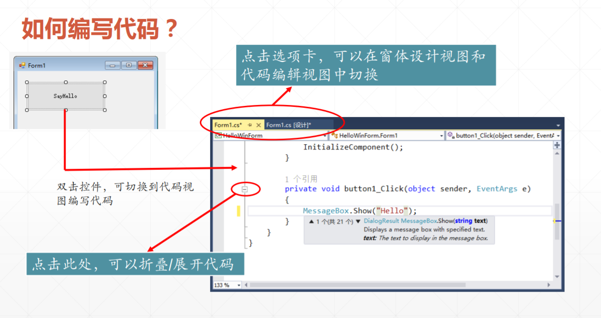
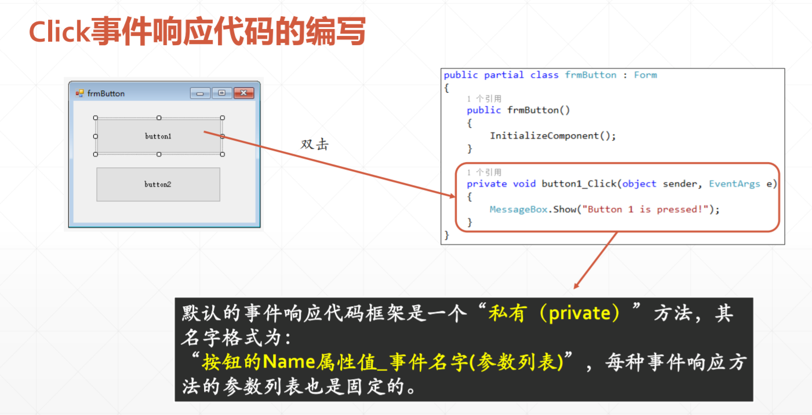

 掌握桌面程序开发、熟悉常用的控件 
<!-- more -->

# 使用VisualStudio 编写GUI程序

本博客内容由金旭亮老师网上上传的文档制作，在此特地感谢！

## GUI应用程序简介


## 使用VisualStudio设计可视化桌面应用





## 快速应用开发模式


# 常用Winform控件使用


## 按钮控件





### 设计带图标的按钮


### 资源的使用


### 使用资源后需要注意的属性


## 标签控件


## 文本控件


## 进度条和小闹钟控件


```csharp
namespace ProgressBarAndTimer
{
    public partial class frmMain : Form
    {
        public frmMain()
        {
            InitializeComponent();
            ShowProgressBarValue(AutoProgressBar.Value);
        }

        private void ShowProgressBarValue(int value)
        {
            lblInfo.Text = string.Format("{0}%", value);
        }
        #region "事件响应"
        private void btnIncrease_Click(object sender, EventArgs e)
        {
            if (ManualProgressBar.Value + 2 > ManualProgressBar.Maximum)
            {
                ManualProgressBar.Value = ManualProgressBar.Maximum;
            }
            else
            {
                ManualProgressBar.Value += 2;
            }

        }

        private void btnDecrease_Click(object sender, EventArgs e)
        {
            if (ManualProgressBar.Value - 2 < ManualProgressBar.Minimum)
            {
                ManualProgressBar.Value = ManualProgressBar.Minimum;
            }
            else
            {
                ManualProgressBar.Value -= 2;
            }
        }

        private void timer1_Tick(object sender, EventArgs e)
        {
            if (AutoProgressBar.Value + 2 > AutoProgressBar.Maximum)
            {
                //自动回头
                AutoProgressBar.Value = 0;
            }
            else
            {
                AutoProgressBar.Value += 2;
            }
            ShowProgressBarValue(AutoProgressBar.Value);
        }

        private void btnTimer_Click(object sender, EventArgs e)
        {
            timer1.Enabled = !timer1.Enabled;
            if (timer1.Enabled == true)
            {
                btnTimer.Image = Resources.DisableClock;

            }
            else
            {
                btnTimer.Image = Resources.EnableClock;
            }
        }

        #endregion
    }
}
```


## 控件学习指导


# 使用容器控件布局窗体

## 学会学习


## 控件Anchor属性


## 控件Dock属性


```csharp
namespace FormCtrlProperty
{
    public partial class frmDock : Form
    {
        public frmDock()
        {
            InitializeComponent();
        }

        private void rdoNone_CheckedChanged(object sender, EventArgs e)
        {
            button1.Dock = DockStyle.None;
        }

        private void rdoLeft_CheckedChanged(object sender, EventArgs e)
        {
            button1.Dock = DockStyle.Left;
        }

        private void rdoRight_CheckedChanged(object sender, EventArgs e)
        {
            button1.Dock = DockStyle.Right;
        }

        private void rdoTop_CheckedChanged(object sender, EventArgs e)
        {
            button1.Dock = DockStyle.Top;
        }

        private void rdoBottom_CheckedChanged(object sender, EventArgs e)
        {
            button1.Dock = DockStyle.Bottom;
        }

        private void rdoFill_CheckedChanged(object sender, EventArgs e)
        {
            button1.Dock = DockStyle.Fill;
        }
    }
}

```

## 容器控件


### 面板Panel


```csharp
namespace ContainerDemo
{
    public partial class frmPanel : Form
    {
        public frmPanel()
        {
            InitializeComponent();
        }

        private void btnShowOrHide_Click(object sender, EventArgs e)
        {
            if (rdoOuter.Checked)
            {
                pnlOuter.Visible = !pnlOuter.Visible;

            }
            else
            {
                pnlInner.Visible = !pnlInner.Visible;
            }
            ChangebtnShowOrHideText();
        }

        private void btnEnableOrDisable_Click(object sender, EventArgs e)
        {
            if (rdoOuter.Checked)
            {
                pnlOuter.Enabled = !pnlOuter.Enabled;
            }
            else
            {
                pnlInner.Enabled = !pnlInner.Enabled;
            }
            ChangebtnEnableOrDisableText();
        }

        private void ChangebtnShowOrHideText()
        {
            if (rdoOuter.Checked)
            {
                btnShowOrHide.Text = pnlOuter.Visible ? "隐藏" : "显示";

            }
            else
            {
                btnShowOrHide.Text = pnlInner.Visible ? "隐藏" : "显示";
            }
        }
        private void ChangebtnEnableOrDisableText()
        {
            if (rdoOuter.Checked)
            {
                btnEnableOrDisable.Text = pnlOuter.Enabled ? "禁用" : "激活";

            }
            else
            {
                btnEnableOrDisable.Text = pnlInner.Enabled ? "禁用" : "激活";
            }
        }

        private void rdoOuter_CheckedChanged(object sender, EventArgs e)
        {
            ChangebtnEnableOrDisableText();
            ChangebtnShowOrHideText();
        }

        private void rdoInner_CheckedChanged(object sender, EventArgs e)
        {
            ChangebtnEnableOrDisableText();
            ChangebtnShowOrHideText();
        }
    }
}
```

### 组合框GropBox


### 选项卡TabControl


```csharp
namespace ContainerDemo
{
    public partial class frmTabControl : Form
    {
        public frmTabControl()
        {
            InitializeComponent();
            tabCount = tabControl1.TabPages.Count;
        }

        private int tabCount = 0;
        private Random ran = new Random();
        private void btnAddTab_Click(object sender, EventArgs e)
        {
            tabCount++;
            TabPage newPage = new TabPage("tabPage" + tabCount);
            newPage.BackColor = Color.FromArgb(
                ran.Next(0,255),
                ran.Next(0,255),
                ran.Next(0,255));
            tabControl1.TabPages.Add(newPage);

        }

        private void btnActiveLeft_Click(object sender, EventArgs e)
        {
            if (tabControl1.SelectedIndex != 0)
            {
                tabControl1.SelectTab(tabControl1.SelectedIndex - 1);
            }
        }

        private void btnActiveRight_Click(object sender, EventArgs e)
        {
            if (tabControl1.SelectedIndex != tabControl1.TabPages.Count - 1)
            {
                tabControl1.SelectTab(tabControl1.SelectedIndex + 1);
            }
        }
    }
}
```


# 使用容器控件布局窗体

## 分割条面板SplitContainer


## FlowLayout控件


```csharp
namespace LayoutDemos
{
    public partial class frmFlowLayout : Form
    {
        public frmFlowLayout()
        {
            InitializeComponent();
        }

        private int counter = 0;
        private void btnAddButton_Click(object sender, EventArgs e)
        {
            counter++;
            Button btn = new Button();
            btn.Text = "按钮" + counter;
            flowLayoutPanel1.Controls.Add(btn);

        }

        private void chkWrapContents_CheckedChanged(object sender, EventArgs e)
        {

                flowLayoutPanel1.WrapContents = chkWrapContents.Checked;

        }

        private void chkAutoScroll_CheckedChanged(object sender, EventArgs e)
        {
            flowLayoutPanel1.AutoScroll = chkAutoScroll.Checked;
        }

        private void cboFlowDirection_SelectedIndexChanged(object sender, EventArgs e)
        {
            switch (cboFlowDirection.Text)
            {
                case "BottomUp":
                    flowLayoutPanel1.FlowDirection = FlowDirection.BottomUp;
                    break;
                case "LeftToRight":
                    flowLayoutPanel1.FlowDirection = FlowDirection.LeftToRight;
                    break;
                case "RightToLeft":
                    flowLayoutPanel1.FlowDirection = FlowDirection.RightToLeft;
                    break;
                case "TopDown":
                    flowLayoutPanel1.FlowDirection = FlowDirection.TopDown;
                    break;
                default:
                    break;
            }
        }
    }
}

```

## TabelLayoutPanel


# 复杂一些的控件

## 对话框


```csharp
namespace DialogDemo
{
    public partial class frmMain : Form
    {
        public frmMain()
        {
            InitializeComponent();
        }

        private void btnOpenFile_Click(object sender, EventArgs e)
        {
            openFileDialog1.Title = "选择一张图片";
            openFileDialog1.Filter = "所有支持的图片文件|*.jpg;*.gif;*.png;*.bmp|任意文件（*.*）|*.*";
            openFileDialog1.FileName = "";
            openFileDialog1.InitialDirectory = Environment.GetFolderPath(Environment.SpecialFolder.MyPictures);
            openFileDialog1.CheckFileExists = true;
            openFileDialog1.CheckPathExists = true;

			//是否允许选择多个文件
            //openFileDialog1.Multiselect = false;
            openFileDialog1.Multiselect = true;
            if (openFileDialog1.ShowDialog() == DialogResult.OK)
            {
                if (openFileDialog1.Multiselect == false)
                {
                    lblInfo.Text = openFileDialog1.FileName;
                }
                else
                {
                    StringBuilder sb = new StringBuilder();
                    foreach (var file in openFileDialog1.FileNames)
                    {
                        sb.Append(file);
                        sb.Append("\n");
                    }
                    lblInfo.Text = sb.ToString();
                }
            }

        }

        private void btnSaveFile_Click(object sender, EventArgs e)
        {
        	//设置默认文件扩展名
            saveFileDialog1.DefaultExt = ".txt";
            //指定文件名存在，是否提示警告
            saveFileDialog1.OverwritePrompt = true;
            saveFileDialog1.Title = "保存文件";
            if (saveFileDialog1.ShowDialog() == DialogResult.OK)
            {
                lblInfo.Text = "文件己保存到：" + saveFileDialog1.FileName;
            }
        }

        private void btnFontDialog_Click(object sender, EventArgs e)
        {
            if (fontDialog1.ShowDialog() == DialogResult.OK)
            {
                lblInfo.Font = fontDialog1.Font;
            }
        }

        private void btnColor_Click(object sender, EventArgs e)
        {
            if (colorDialog1.ShowDialog() == DialogResult.OK)
            {
                lblInfo.ForeColor = colorDialog1.Color;
            }
        }
    }
}
```


## 下拉菜单


弹出式菜单：例如鼠标点右键


## 弹出式菜单


```csharp
namespace MenuDemo
{
    public partial class frmMain : Form
    {
        public frmMain()
        {
            InitializeComponent();
        }

        private void mnuExit_Click(object sender, EventArgs e)
        {
            Close();
        }

        private void menuOpen_Click(object sender, EventArgs e)
        {
            openFileDialog1.ShowDialog();
        }

        private void btnEnable_Click(object sender, EventArgs e)
        {
            FileMenuItem.Enabled = !FileMenuItem.Enabled;
        }

        private int SaveCount = 0;
        private void mnuSave_Click(object sender, EventArgs e)
        {
            SaveCount++;
            mnuSave.Text = string.Format("保存({0})", SaveCount);
        }

        private void btnExchange_Click(object sender, EventArgs e)
        {
            menuStripEdit.Visible = !menuStripEdit.Visible;
            menuStripFile.Visible = !menuStripFile.Visible;
        }

        private void buttonShowContextMenu_Click(object sender, EventArgs e)
        {
       									 //相对于指定控件定位
            contextMenuStripExample.Show(sender as Control,20,25);
        }
    }
}
```

## 状态条


```csharp
namespace StatusStripDemo
{
    public partial class frmStatusStrip : Form
    {
        public frmStatusStrip()
        {
            InitializeComponent();
        }

        private void btnShowTime_Click(object sender, EventArgs e)
        {
            timerForCurrentTime.Enabled = !timerForCurrentTime.Enabled;
        }

        private void timer1_Tick(object sender, EventArgs e)
        {
            toolStripStatusLabel1.Text = DateTime.Now.ToLongTimeString();
        }

        private void ToolStripMenuItem1_Click(object sender, EventArgs e)
        {
            MessageBox.Show("菜单项一");
        }

        private void ToolStripMenuItem2_Click(object sender, EventArgs e)
        {
            MessageBox.Show("菜单项二");
        }

        private void ToolStripMenuItem3_Click(object sender, EventArgs e)
        {
            MessageBox.Show("菜单项三");
        }

        private void btnShowProgress_Click(object sender, EventArgs e)
        {
            toolStripProgressBar1.Visible = true;
            toolStripProgressBar1.Value = 0;
            timerForProgress.Enabled = true;
            btnShowProgressBar.Enabled = false;
        }

        private void timerForProgress_Tick(object sender, EventArgs e)
        {
            if (toolStripProgressBar1.Value < 100)
                toolStripProgressBar1.Value += 5;
            else
            {
                toolStripProgressBar1.Visible = false;
                timerForProgress.Enabled = false;
                btnShowProgressBar.Enabled = true;
            }

        }
    }
}
```


## 树


```csharp
namespace TreeDemo
{
    public partial class frmMain : Form
    {
        public frmMain()
        {
            InitializeComponent();
        }

        private void btnNewTopNode_Click(object sender, EventArgs e)
        {
            string NodeText = "";
            if (!string.IsNullOrEmpty(txtNewNodeText.Text.Trim()))
            {
                NodeText = txtNewNodeText.Text;
            }
            else
            {
                NodeText = "新根节点" + (treeView1.GetNodeCount(true) + 1);

            }

            treeView1.Nodes.Add(NodeText);
        }

        private void btnAddBrotherNode_Click(object sender, EventArgs e)
        {
            string NodeText = "";
            if (treeView1.SelectedNode != null && treeView1.SelectedNode.Parent!=null)
            {
                if (!string.IsNullOrEmpty(txtNewNodeText.Text.Trim()))
                {
                    NodeText = txtNewNodeText.Text;
                }
                else
                {
                    NodeText = "新兄弟节点" + (treeView1.GetNodeCount(true) + 1);
                }
                treeView1.SelectedNode.Parent.Nodes.Add(NodeText);
            }
        }

        private void btnAddChildNode_Click(object sender, EventArgs e)
        {
            string NodeText = "";
            if (treeView1.SelectedNode != null)
            {
                if (!string.IsNullOrEmpty(txtNewNodeText.Text.Trim()))
                {
                    NodeText = txtNewNodeText.Text;
                }
                else
                {
                    NodeText = "新子节点" + (treeView1.GetNodeCount(true) + 1);
                }
                treeView1.SelectedNode.Nodes.Add(NodeText);
                treeView1.SelectedNode.Expand();
            }
        }

        private void btnDeleteNode_Click(object sender, EventArgs e)
        {
            if (treeView1.SelectedNode != null)
            {
                if (treeView1.SelectedNode.Parent != null)
                {
                    treeView1.SelectedNode.Parent.Nodes.Remove(treeView1.SelectedNode);
                }
                else
                {
                    treeView1.Nodes.Remove(treeView1.SelectedNode);
                }
            }
        }

        private void btnClearTreeNodes_Click(object sender, EventArgs e)
        {
            treeView1.Nodes.Clear();
        }

        private void btnExpandCollapseNode_Click(object sender, EventArgs e)
        {
            if (treeView1.SelectedNode != null)
            {
                if (treeView1.SelectedNode.IsExpanded)
                {
                    treeView1.SelectedNode.Collapse(true);
                }
                else
                {
                    treeView1.SelectedNode.Expand();
                }
            }
        }

        private void treeView1_AfterSelect(object sender, TreeViewEventArgs e)
        {
            txtNodeText.Text = e.Node.Text;
        }

        private void btnNodeRename_Click(object sender, EventArgs e)
        {
            if (txtNodeText.Text.Trim().Length > 0)
            {
                treeView1.SelectedNode.Text = txtNodeText.Text.Trim();
            }
        }
    }
}
```
