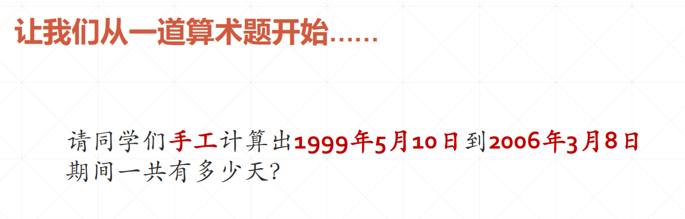
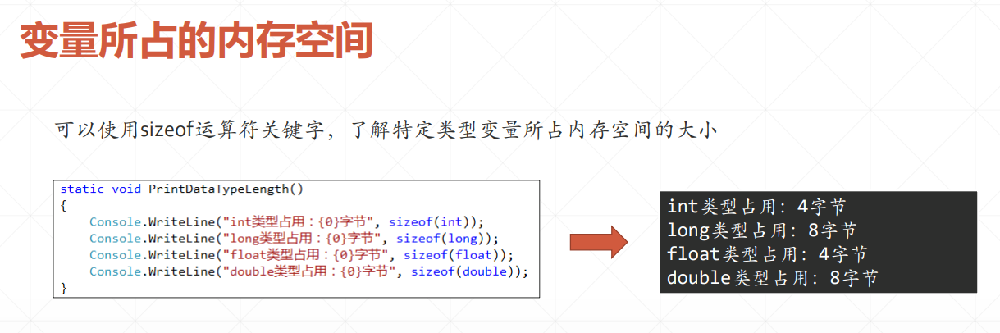

了解C#语言历史、编程工具、运行原理、基础语法...... 
<!-- more -->

# C#与.NET来世今生

## C#语言编程史


## Windows与.NET技术发展的历程及趋势


## 什么是.NET


# 使用VisualStudio编程工具

## 认识Visual Studio


## Console的重要属性


## 控制台窗口的输入与输出


## ReadKey和Beep


## 程序调试基本技巧


## C#与Visual Studio编程须知

### 基本编程规则


### 文件组织方式


### 行号、颜色、字体大小


# 面向对象概述与.NET运行原理

## 面向对象编程概述


## 程序是如何被计算机执行的？


## 如何编写计算机可以执行的程序？


## 怎样构造求解问题的算法？


## 日期计算结构化编程的实现




## 日期计算面向对象编程的实现


# 变量、数据类型与表达式

## 理解变量


## 数据类型


## String和Var


## 变量与内存




## 数据类型转换


## 运算符与表达式


# 选择结构与逻辑表达式


## if/else 选择结构


## 选择结构的嵌套


## 逻辑表达式的组合


## 多分支结构


# 循环结构


## while/do 循环


```csharp
     static void InputQuitToStop()
        {
            string userInput = "";

            while (userInput.ToLower() != "quit")
            {
                Console.WriteLine("\n不断输入字符串，回车结束一次输入。不想再运行程序时，输入quit。");
                userInput = Console.ReadLine();
                if (string.IsNullOrEmpty(userInput) == false)
                {
                    Console.WriteLine("您输入了：{0}", userInput);
                }
            }
            Console.WriteLine("\n---------------------------------------------");
            Console.WriteLine("\n检测到quit命令，循环中止，敲任意键退出……");
        }
```


## for循环


## Break和Continue


```csharp
        /// <summary>
        /// 理解Break和Continue的不同作用
        /// </summary>
        static void BreakAndContinue()
        {
            for (int i = 1; i <= 10; i++)
            {
                if (i == 5)
                {
                    //切换以下两句的注释，体会它们的不同作用
                    //continue;
                    break;

                }
                Console.WriteLine("第{0}轮循环", i);
            }
        }
```


## foreach循环


## 控制台程序编程小技巧


  ```csharp
  //测试如何检测按键
        static void testKey()
        {
            Console.WriteLine("随意敲任意键查看其键值，压ESC退出");
            ConsoleKeyInfo key;
            do
            {
                //用户敲了按键了吗？
                while (!Console.KeyAvailable)
                {
                    //啥也不干，等待……
                }
                //等待用户击键
                key = Console.ReadKey(true);
                Console.WriteLine();//输出一个空行
                Console.WriteLine("Modifiers值={0}", key.Modifiers);
                Console.WriteLine("KeyChar值={0}", (int)(key.KeyChar));
                Console.WriteLine("Key值={0}", key.Key);
                //CapsLock这个键是不能被捕获的，但我们可以检测出键盘的状态
                if (Console.CapsLock)
                {
                    Console.WriteLine("处于大写状态");
                }
                //NumberLock这个键是不能被捕获的，但我们可以检测出键盘的状态
                if (Console.NumberLock)
                {
                    Console.WriteLine("小键盘上的Num Lock键被按下");
                }
                //检测控制键
                if (key.Modifiers != 0)
                {
                    if ((key.Modifiers & ConsoleModifiers.Alt) != 0)
                    {
                        Console.WriteLine("Alt键被按下");
                    }
                    if ((key.Modifiers & ConsoleModifiers.Control) != 0)
                    {
                        Console.WriteLine("Ctrl键被按下");
                    }
                    if ((key.Modifiers & ConsoleModifiers.Shift) != 0)
                    {
                        Console.WriteLine("Shift键被按下");
                    }
                }
            } while (key.Key != ConsoleKey.Escape);
            Console.WriteLine("\n检测到ESC键，敲任意键退出……\n");
        }
  ```


```c#
        /// <summary>
        /// 展示系统内置的强制中止控制台程序的功能
        /// </summary>
        static void QuitConsoleApp()
        {
            Console.WriteLine("死循环：请使用Ctrl+C或Ctrl+Break强制中止本程序");
            while (true)
            {
                Console.WriteLine("当前时间：" + DateTime.Now.ToLocalTime());
                Thread.Sleep(2000);
            }
        }


        /// <summary>
        /// 禁用Ctrl+C
        /// </summary>
        static void DisableControlC()
        {
            Console.WriteLine("本程序只能通过ESC键结束，无法通过Ctrl+C而中止");
            Console.TreatControlCAsInput = true;
            do
            {
                var key = Console.ReadKey(true);

                if (key.Key == ConsoleKey.Escape)
                {
                    Console.WriteLine("检测到ESC键，敲任意键退出……");
                    break;
                }
            } while (true);

        }
```


```csharp
       /// <summary>
        /// 响应UseCancelKeyPress事件，屏蔽掉Ctrl+C和Ctrl+Break
        /// </summary>
        static void UseCancelKeyPress()
        {
            Console.WriteLine("本程序只能通过ESC键结束");
            //响应CancelKeyPress事件（即Ctrl+C和Ctrl+Break被按下）
            Console.CancelKeyPress += Console_CancelKeyPress;

            do
            {
                var key = Console.ReadKey(true);

                if (key.Key == ConsoleKey.Escape)
                {
                    Console.WriteLine("\n检测到ESC键，敲任意键退出……");
                    break;
                }
                if (key.KeyChar != '\0')
                {
                    if (key.Key == ConsoleKey.Enter)
                    {
                        Console.WriteLine();
                    }
                    else
                    {
                        Console.Write(key.KeyChar);
                    }
                }
            } while (true);

        }
        private static void Console_CancelKeyPress(object sender, ConsoleCancelEventArgs e)
        {
            var isCtrlC = e.SpecialKey == ConsoleSpecialKey.ControlC;
            var isCtrlBreak = e.SpecialKey == ConsoleSpecialKey.ControlBreak;
            //如果是Ctrl+C和Ctrl+Break
            if (isCtrlC || isCtrlBreak)
            {
                //屏蔽掉它们，让它们不起作用
                e.Cancel = true;
                //通知用户，Ctrl+C和Ctrl+Break已经不起作用了……
                Console.WriteLine(isCtrlC ? "Ctrl+C已被屏蔽" : "Ctrl+Break已被屏蔽");
            }
        }
```

# 方法


## 方法定义与调用


## 方法重载


## 方法应用实例


```csharp
namespace ShowPicInForm
{
    public partial class frmMain : Form
    {
        public frmMain()
        {
            InitializeComponent();
        }

        private void LoadPicture()
        {
            if (openFileDialog1.ShowDialog() == DialogResult.OK)
            {
                string FileName = openFileDialog1.FileName;
                picImage.ImageLocation = FileName;
            }
        }

        private void btnLoadPic_Click(object sender, EventArgs e)
        {
            LoadPicture();
        }
    }
}
```


```csharp
namespace Pseudorandom
{
    public partial class frmMain : Form
    {
        public frmMain()
        {
            InitializeComponent();
        }
        private float a = 3; //乘数,注意，a>=2 and a<m
        private int m = 100;  //模
        private float c = 4;  //增量，注意，c>=0 and c<m

        //依据公式计算出下一个随机数
        private float GetNextRanNumber(int m, float a, float c, float prevNum)
        {
            return (a * prevNum + c) % m;
        }

        //按指定的种子Seed生成nums个随机数
        private void GenerateRandomSequence(int nums, float seed)
        {
            float lastNum, nextNum;
            lastNum = seed;
            //清空富文本框
            RichTextBox1.Clear();
            //追加字符串到富文本框中
            RichTextBox1.AppendText(seed.ToString());
            for (int i = 0; i < nums; i++)
            {
                nextNum = GetNextRanNumber(m, a, c, lastNum);
                RichTextBox1.AppendText(" ," + nextNum);
                lastNum = nextNum;
            }
        }

        private void btnGenerate_Click(object sender, EventArgs e)
        {
            int nums = Convert.ToInt32(txtNumbers.Text);
            float seed = Convert.ToSingle(txtSeed.Text);
            GenerateRandomSequence(nums, seed);
        }

    }
}
```


# 递归

## 递归概述


## 递归编程技巧


```csharp
namespace CalculateN
{
    public partial class frmCalculate : Form
    {
        public frmCalculate()
        {
            InitializeComponent();
        }

        private void btnCalculate_Click(object sender, EventArgs e)
        {
            int n = Convert.ToInt32(txtN.Text);
            lblResult.Text = n.ToString()+"!="+Factorial(n).ToString();
            //lblResult.Text = n.ToString() + "!=" + Factorial2(n).ToString();

        }
        //计算n!，用递归实现
        private long Factorial(int n)
        {
            if (n == 1)
               return 1;
            long ret;
            ret = Factorial(n - 1) * n;
            return ret;

        }
        //计算n!，用递推实现
        private long Factorial2(int n)
        {
            long result = 1;
            for(int i = 1; i <= n; i++)
            {
                result *= i;
            }
            return result;
        }
    }
}
```


```csharp
namespace Recursion
{
    public partial class frmMain : Form
    {
        public frmMain()
        {
            InitializeComponent();
        }
        private string Story = "";

        //故事主体：
        private void WriteStory()
        {
            Story = "从前有座山，山里有座庙。\n";
            Story += "庙里有两个和尚，在讲故事。\n";
            Story += "讲什么故事呢？……\n";
        }

        private void btnExecute_Click(object sender, EventArgs e)
        {
            //清空文本
            RichTextBox1.Text = "";
            //老和尚开始没完没了地讲故事
            DoRecursion((int)updnTimes.Value);
        }
        //用于实现递归调用
        private void DoRecursion(int times)
        {
            //结束条件
            if (times == 0)
                return;

            //每次递归调用时要完成的工作
            //to do: 如果将以下这两句移到DoRecursion()一句之后，
            //       会发生什么？
            //RichTextBox1.AppendText("第 " + times + " 次\n");
            //RichTextBox1.AppendText(Story);

            //递归调用，参数减一
            DoRecursion(times - 1);

            //////每次递归调用时要完成的工作
            RichTextBox1.AppendText("第 " + times + " 次\n");
            RichTextBox1.AppendText(Story);

        }
        private void Form1_Load(object sender, EventArgs e)
        {
            //把故事主体写好
            WriteStory();
        }
    }
}
```


## 处理大整数


```csharp
namespace GetFibonacciNumber
{
    public partial class frmMain : Form
    {
        public frmMain()
        {
            InitializeComponent();
            ShowCalculateResult();
        }
        private long FibonacciUseLong(int NumberIndex)
        {
            long previousValue = -1;
            long currentResult = 1;
            for (var i = 0; i <= NumberIndex; ++i)
            {
                if (long.MaxValue - currentResult < previousValue)
                {
                    throw new OverflowException("超过了本计算机能计算的最大整数！");
                }
                long sum = currentResult + previousValue;
                previousValue = currentResult;
                currentResult = sum;
            }
            return currentResult;
        }

        private BigInteger FibonacciUseBigInteger(int NumberIndex)
        {
            BigInteger previousValue = -1;
            BigInteger currentResult = 1;
            for (var i = 0; i <= NumberIndex; ++i)
            {
                BigInteger sum = currentResult + previousValue;
                previousValue = currentResult;
                currentResult = sum;
            }
            return currentResult;
        }

        /// <summary>
        /// 显示计算结果
        /// </summary>
        private void ShowCalculateResult()
        {
            try
            {
                if (rdoLong.Checked)
                    lblResult.Text = FibonacciUseLong((int)numericUpDown1.Value).ToString();
                else
                    lblResult.Text = FibonacciUseBigInteger((int)numericUpDown1.Value).ToString();
            }
            catch (Exception ex)
            {
                lblResult.Text = ex.Message;
            }

        }

        private void numericUpDown1_ValueChanged(object sender, EventArgs e)
        {
            ShowCalculateResult();
        }

        private void radioButton1_CheckedChanged(object sender, EventArgs e)
        {
            ShowCalculateResult();
        }

        private void rdoLong_CheckedChanged(object sender, EventArgs e)
        {
            ShowCalculateResult();
        }

    }
}
```

## 浮点数的处理技巧


