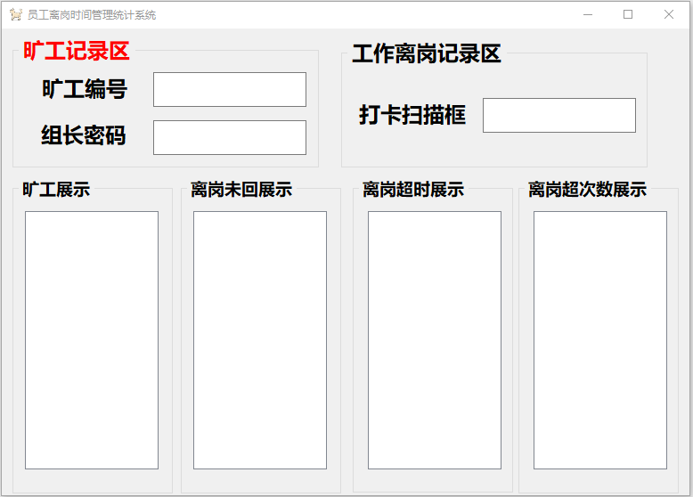

 生产线员工离岗记录小软件 
<!-- more -->

##  一、需求

> 记录于2019.2.15上午生产线

为了便于管理公司生产线员工在生产时间是否外出超时和旷工，产线老大今天叫我写一个简单的小软件，丢弃以前手动填写excel的方式并且对表格加密（记录的时间不准确，手工可以改）另外软件展示离岗超时名单，可以给其他离岗员工提醒，便于约束产线员工行为。

## 二、分析

一、 数据准备：

需要一个简单工号和姓名数据对应表，因为产线员工也有流动性，也得时常增加员工和编号-----在此，我选择用一个文本保存，一条信息一行 如：张三*1001  

1. 软件初始化时，读取，封装成对象集合，用于判断员工工号的正确性.
2. 对象的查找，使用`Linq`查询实现

二、类的分析：

操作写Excel类、员工实体类(记录基本信息，封装对象)、窗体界面类里实现基本简单业务逻辑

1. Excel操作类，做一个写操作接口（传入要写的对象）
2. 员工实体类-记录姓名，ID，日期、离开时间，回来时间、离岗次数、是否超时


## 三、涉及到的基本知识点

1. `LINQ`查询
2. 对象的封装
3. 微软官方的`Microsoft.Office.Interop.Excel`基础操作
4. 文件IO读操作
5. 函数的命名参数的使用(Excel操作类，保存，打开用到密码)

## 四、具体实现

### 1、软件界面设计



### 2、软件初始化操作

建立软件文件夹、员工信息txt、员工信息的基本excel的创建

```csharp
//软件启动初始化工作---建立文件夹和员工信息文本
private void initConfig()
{            
	if (!Directory.Exists(@"D:\离岗记录软件配置文件夹"))
	{
		Directory.CreateDirectory(@"D:\离岗记录软件配置文件夹");
	}

	if (!File.Exists(@"D:\离岗记录软件配置文件夹\员工信息.txt"))
	{
		using (FileStream fs = new FileStream(@"D:\离岗记录软件配置文件夹\员工信   息.txt", FileMode.Create))
		{
			StreamWriter sw = new StreamWriter(fs, Encoding.Default);
			sw.WriteLine("请从下一行开始按照示例规范填写员工信息,如：张三*120");
			sw.WriteLine("张三*100");
			sw.WriteLine("李四*110");
			sw.WriteLine("王五*120");
			sw.Flush();
			sw.Close();
		}
	}		
}
```

```csharp
//软件启动初始化工作---读取员工姓名和编号  封装到集合中
private void ReadEmployeeInfo()
{
	using (FileStream fs = new FileStream(@"D:\离岗记录软件配置文件夹\员工信息.txt", FileMode.Open))
	{
		//Encoding.Default 防止中文乱码
		StreamReader sr = new StreamReader(fs, Encoding.Default);

		//第一行是提示信息，读取作废
		string employee = sr.ReadLine();

		while (true)
		{
			employee = sr.ReadLine();

			if (employee != "" && employee != null)
			{
				//切割成数组
				string[] employeeArray = employee.Split('*');

				//封装对象，添加到集合中---该集合是窗体对象属性
				employeeInfos.Add(new EmployeeInfo()
				{
					Name = employeeArray[0],
					ID = employeeArray[1]
				});
			}
			else
			{
				break;
			}
		}
		sr.Close();
	}
}
```

```csharp
//创建Excel文件，初始化表头
private void initExcel()
{
	if (!File.Exists(@"D:\离岗记录软件配置文件夹\员工离岗信息记录.xlsx"))
	{
		//创建Excel
		Excel.Application excelApp= new Excel.Application();
		
		excelApp.Visible = false;
		
		//将此属性设置为False ，如果您不想被打扰提示和通知消息
		excelApp.DisplayAlerts = false;
		
		//创建一个新的工作簿。 新工作簿成为活动工作簿。 返回Workbook对象。
		Excel.Workbook workBook = excelApp.Workbooks.Add(true);
		
		//在活动工作簿或工作簿的指定的窗口中，则返回一个对象，表示活动工作表 
		Excel.Worksheet workSheet  = excelApp.ActiveSheet as Excel.Worksheet;
		
		workSheet.Cells[1, "A"] = "姓名";
		workSheet.Cells[1, "B"] = "ID";
		workSheet.Cells[1, "C"] = "日期";
		workSheet.Cells[1, "D"] = "离开时间";
		workSheet.Cells[1, "E"] = "回来时间";
		workSheet.Cells[1, "F"] = "离岗次数";
		workSheet.Cells[1, "G"] = "是否超时";
		workSheet.Cells[1, "H"] = "是否超次数";
		workSheet.Cells[1, "I"] = "是否离岗";
		
		workBook.SaveAs(@"D:\离岗记录软件配置文件夹\员工离岗信息记录.xlsx");
		workBook.Close();

		excelApp.Quit();
		//设置为null 方便垃圾回收机制回收资源
		workSheet = null;
		workBook = null;
		excelApp = null;
		GC.Collect();
	} 
// excel文件存在了，可以创建操作excel对象了
	excelOperationObj = new ExcelOperation(@"D:\离岗记录软件配置文件夹\员工离岗信息记录.xlsx");

}
```

## 3、实体类设计

```csharp
public class EmployeeInfo
	{

		public string Name { get; set; }
		public string ID { get; set; }
		//离开时间
		public List<DateTime> DepatureTime { get; set; } = new List<DateTime>();

		//回来时间
		public List<DateTime> ComeBackTime { get; set; } = new List<DateTime>();

		//员工离岗次数
		public int LeaveCount { get; set; } = 0;

		//离岗信息  姓名+超出的规定次数   一条信息展示
		public string Leaveinfo1 { get; set; } 

		//离岗信息  姓名+超时时间---      多条信息展示
		public List<string> Leaveinfo2 { get; set; } = new List<string>();

		//是否超时      便于excel查看
		public string IsOverTime { get; set; }

		//是否超次数   便于excel查看
		public string IsOverOut { get; set; }

		//是否离岗  便于Excel查看
		public string ISAbsent { get; set; }

	}
```

### 4、LINQ查询判断

```csharp
//通过员工编号，找到员工对象
private EmployeeInfo FindEmployeeById(string id)
{
	IEnumerable<EmployeeInfo> employeeList = from mployeeInfo in employeeInfos
					        where mployeeInfo.ID == id
						select mployeeInfo;
	if (employeeList.Count() != 0)
	{
		return employeeList.First();
	}
	else
	{
		return null;
	}
}
```

### 4、员工离开打卡实现

```csharp
private void txtDepatureNumber_KeyDown(object sender, KeyEventArgs e)
{
	if (e.KeyCode == Keys.Enter)
	{
		string id = this.txtDepatureNumber.Text.Trim();

		//判断输入的是否是存档的员工编号
		EmployeeInfo employeeInfo = FindEmployeeById(id);
		
		if (employeeInfo!=null)
		{				
			// 记录离岗人员--集合中添加，为了防止重复输入，做if处理
			if (!depatureList.Contains(employeeInfo))
			{
				depatureList.Add(employeeInfo);

				//记录离岗时间
				employeeInfo.DepatureTime.Add(System.DateTime.Now);
				
			}

		}
		else
		{
			MessageBox.Show("不存在此员工编号" + id);
		}

		this.txtDepatureNumber.Text = "";
		this.txtBackNumber.Select();
	}
}
```

### 5、员工回来打卡实现

```csharp
private void txtBackNumber_KeyDown(object sender, KeyEventArgs e)
{
	if (e.KeyCode == Keys.Enter)
	{

		string id = this.txtBackNumber.Text.Trim();

		//判断输入的是否是存档的员工编号
		EmployeeInfo employeeInfo = FindEmployeeById(id);

		if (employeeInfo != null)				
		{
			EmployeeDealLogic(employeeInfo);

		}
		else
		{
			MessageBox.Show("不存在此员工编号" + id);
		}
		this.txtBackNumber.Text = "";
		this.txtDepatureNumber.Select();
	}
}


private void EmployeeDealLogic(EmployeeInfo employeeInfo)
{
	
	//离开集合存在 说明确实出去了，否则输入应为无效
	if (depatureList.Contains(employeeInfo))
	{
		// 员工回来，从集合移除该对象
		depatureList.Remove(employeeInfo);

		//记录回来时的时间
		employeeInfo.ComeBackTime.Add(System.DateTime.Now);

		//离岗次数记录
		int count = employeeInfo.DepatureTime.Count;

		//超过10分钟没回，记录到离开超时集合中
		if (employeeInfo.DepatureTime[count - 1].AddSeconds(3) < employeeInfo.ComeBackTime[count - 1])
		{
			//得到员工姓名+超时时间信息
			string info = employeeInfo.Name + " " + (employeeInfo.ComeBackTime[count - 1] - employeeInfo.DepatureTime[count - 1]);

			//设置写excel中 是否超时标题头下  写 是
			employeeInfo.OverTimeinfo = "是";

			//在对象集合属性中，增加这条超时信息
			employeeInfo.Leaveinfo2.Add(info);

			//加入到  离岗超时展示集合中  界面上展示
			this.ListdepatureTimeOut.Items.Add(info);
		}

		//员工离岗次数加1
		employeeInfo.LeaveCount++;

		//离岗次数超过3次
		if (employeeInfo.LeaveCount > 3)
		{
			//修改对象  离岗超次数信息，方便界面显示
			employeeInfo.Leaveinfo1 = employeeInfo.Name + "超 " + (employeeInfo.LeaveCount - 3) + " 次";

			employeeInfo.OverOutCountinfo = "是";

			//防止一个对象多次加入  界面离岗超次数  一个人只展示一次
			if (LeaveOverCountList.Contains(employeeInfo))
			{
				LeaveOverCountList.Remove(employeeInfo);
				LeaveOverCountList.Add(employeeInfo);
			}
			else
			{
				LeaveOverCountList.Add(employeeInfo);
			}

		}

		
		excelOperationObj.writeEmployeeInfo(employeeInfo);

		//记录写入excel后   清空超次数显示，为了 人工看excel好直接定位
		employeeInfo.OverTimeinfo = "";
	}
	else
	{
		this.txtBackNumber.Text = "";
		return;
	}
}
```

### 7、Excel操作类

```csharp
public class ExcelOperation
{

	//系统进程操作
	[DllImport("User32.dll")]
	public static extern int GetWindowThreadProcessId(IntPtr hWnd, out int Processid);

	//存放Excel所在路径
	public string Path { get; set; }

	public Excel.Application excelApp = null;

	public Excel.Workbook workbook = null;

	public Excel.Worksheet worksheet = null;

	//Process  需要  using System.Diagnostics;  静态成员，方便进程的销毁
	static List<Process> processes = new List<Process>();

	//通过构造函数传入路径
	public ExcelOperation(string path)
	{
		this.Path = path;

		//创建Excel操作对象
		excelApp = new Excel.Application();

		excelApp.Visible = false;
		excelApp.DisplayAlerts = false;

		//获取工作薄
		workbook = excelApp.Workbooks.Open(Filename:Path,Password:"654321");

		//加入到进程集合中
		processes.Add(GetExcelProcess(excelApp));

		worksheet = excelApp.ActiveSheet as Excel.Worksheet;

	}

	Process GetExcelProcess(Excel.Application excelApp)
	{
		int id;
		IntPtr intptr = new IntPtr(excelApp.Hwnd);
		GetWindowThreadProcessId(intptr, out id);
		return Process.GetProcessById(id);
	}

	

	public void writeEmployeeInfo(EmployeeInfo employeeInfo)
	{
		try
		{
			//获取数据行数
			int ExcelRowNumber = worksheet.UsedRange.Cells.Rows.Count;
			int writeRow = ExcelRowNumber + 1;

			worksheet.Cells[writeRow, "A"] = employeeInfo.Name;
			worksheet.Cells[writeRow, "B"] = employeeInfo.ID;
			worksheet.Cells[writeRow, "C"] = DateTime.Now.ToString("yyyy/MM/dd");
			worksheet.Cells[writeRow, "D"] = employeeInfo.DepatureTime.Count==0? DateTime.Now : employeeInfo.DepatureTime.Last();
			worksheet.Cells[writeRow, "E"] = employeeInfo.ComeBackTime.Count == 0 ? DateTime.Now : employeeInfo.ComeBackTime.Last();
			worksheet.Cells[writeRow, "F"] = employeeInfo.LeaveCount;
			worksheet.Cells[writeRow, "G"] = employeeInfo.OverTimeinfo;
			worksheet.Cells[writeRow, "H"] = employeeInfo.OverOutCountinfo;
			worksheet.Cells[writeRow, "I"] = employeeInfo.ISAbsent;

			worksheet.Columns.EntireColumn.AutoFit();//列宽自适应。

			workbook.Save();

		}
		catch (Exception ex)
		{

			throw ex;
		}
	}

	public void excelClose()
	{
		
		workbook.Close();
		excelApp.Quit();
		worksheet = null;
		workbook = null;
		excelApp = null;
		GC.Collect();

		// KillProcess();
	}

	public void KillProcess()
	{
		for (int i = 0; i < processes.Count; i++)
		{
			if (processes[i] != null)
			{
				processes[i].Kill();
				processes[i].Dispose();
			}
		}
	}
}
```

