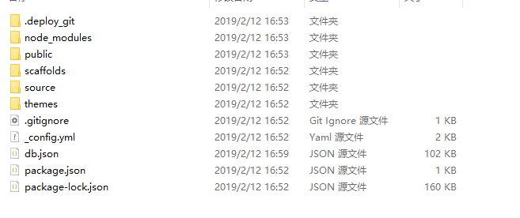
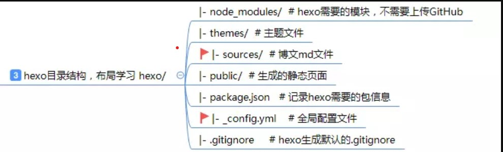
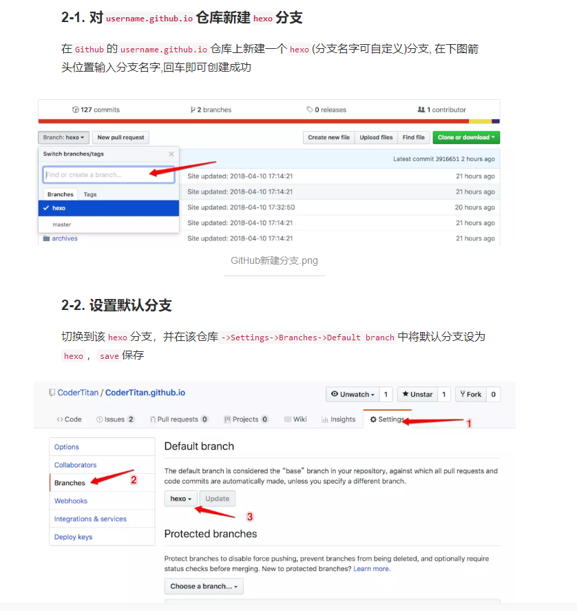
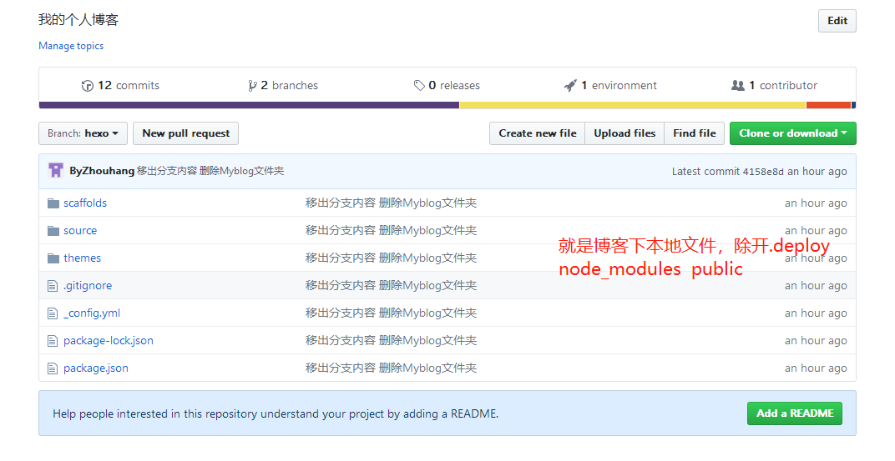

## 场景需求

工作以后大部分时间都是在用办公室里的电脑，现在想在笔记本和办公室的电脑上都能用hexo写博客。

## 思路

- `hexo`生成的静态博客文件都是上传到`GitHub`上的, 且默认放在`master`分支上, 而一些相关的配置文件都在本地

- `hexo`的源文件（部署环境文件）可以都放在`hexo`分支上（可以新创建一个`hexo`分支），换新电脑时，直接`git clone hexo`分支
## 分析

本地博客目录展示





新建一个 hexo 分支，把 hexo 的源文件都放到这个分支上。但是源文件有70多M，并不需要把所有文件都放在分支上。`node_modules`目录可以用 `npm install` 命令生成，`public`目录可以使用 `hexo g` 命令生成（部署到master分支的内容），`.deploy_git`目录是`hexo d`命令生成，所以可以把这三个目录放在 `.gitignore` 里忽略提交。



## 实现步骤

1. 建立hexo分支 将其设置为默认分支

2. 将分支内容clone到本地   

   ​     git  clone  仓库地址   hexo_branch

   命令执行完毕  会创建hexo_branch文件夹（如果先前有写博客发布到master分支,那么目录下的内容就为hexo生成的静态资源--对应原本博客目录下的pulic文件下的内容）  

3. 将clone下来的静态文件全部删除  然后将自己博客目录下的文件夹内容拷贝到hexo_branch 目录里

4. git add .   git commit -m  "上传部署环境文件"    git  push

5. 执行完毕后目录结构如下--至此部署环境文件放在了hexo分支

6. 在新电脑上依次安装git  node.js   然后安装hexo

   ```bash
   $ npm install -g hexo-cli
   ```

7. 新电脑clone刚才的分支  然后执行 

   ```bash
   	npm install
   ```

   安装所有依赖（生成 `node_modules` 目录）。

8. 执行  

   ```bash
   	hexo g
   ```

   生成博客的静态文件（即 `public` 目录）

9. 执行 

   ```bash
   hexo s  //hexo server
   ```

   运行 hexo 服务器，在浏览器中打开 [http://localhost:4000](http://localhost:4000/) 查看博客是否已经可以运行。

10. hexo  new 文章名称   自己编辑好    重启服务可直接查看已编辑内容展示

11. 执行  $ hexo g -d  或者  $ hexo d -g     将静态资源发布到master分支 然后访问自己的github查看

12. 将更改提交到hexo分支

    

## 日常操作

换到不同电脑上时，首先拉下 github 上的 hexo分支的更新


